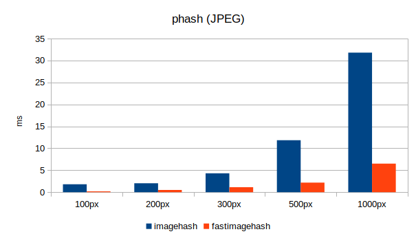
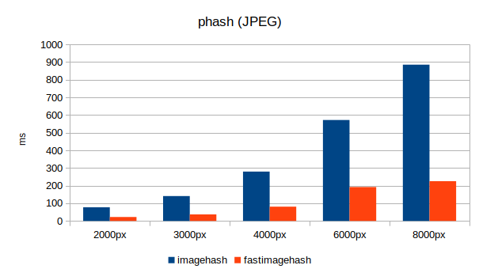
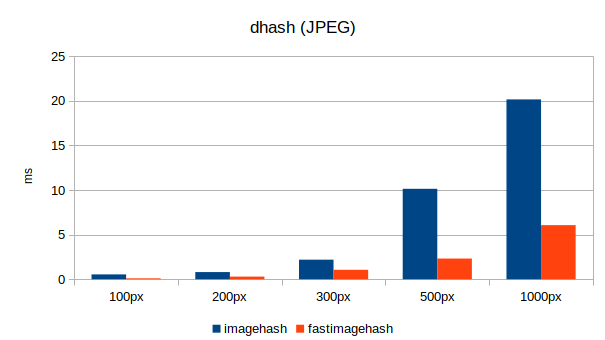
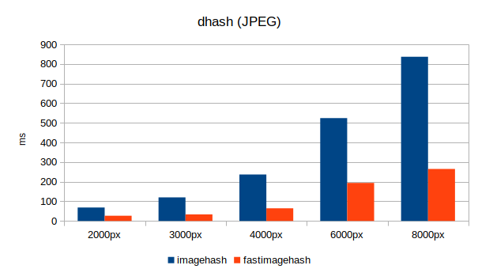
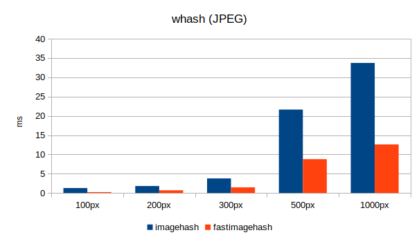
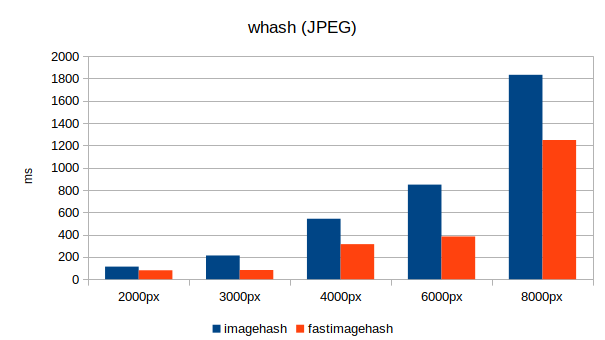
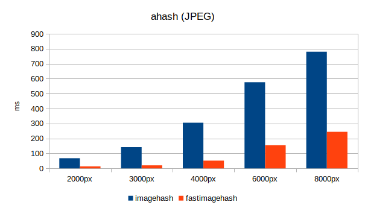
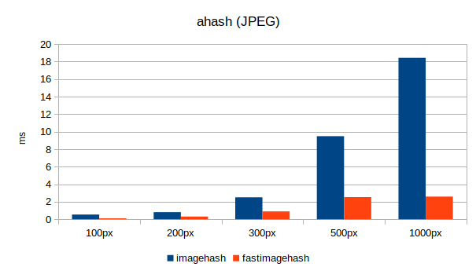
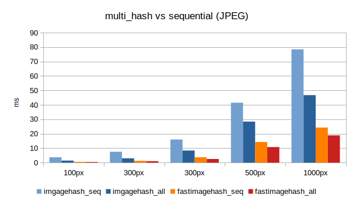
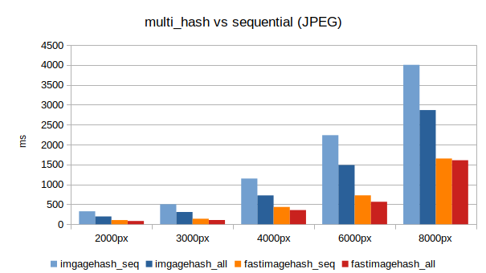

To run the benchmarks:
```bash
python run.py
```

All benchmarks were ran with
```
i7-7500U CPU @ 2.70GHz x 4
gcc version 9.2.0
Python 3.8.0
imagehash 4.0
fastimagehash v0.1
```

### Results
**phash**



**dhash**



**whash**



**ahash**



**multi_hash**


